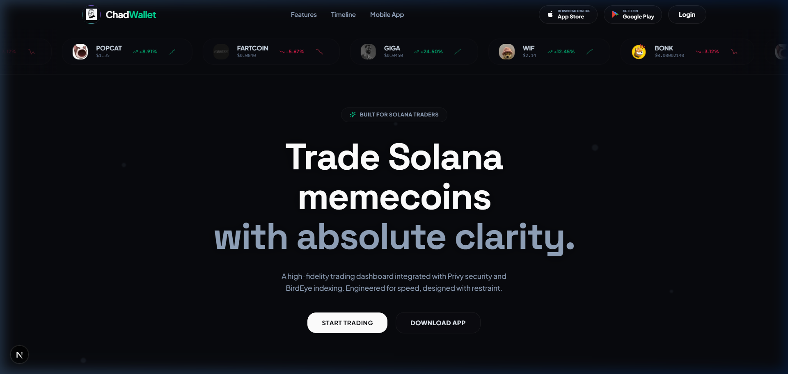
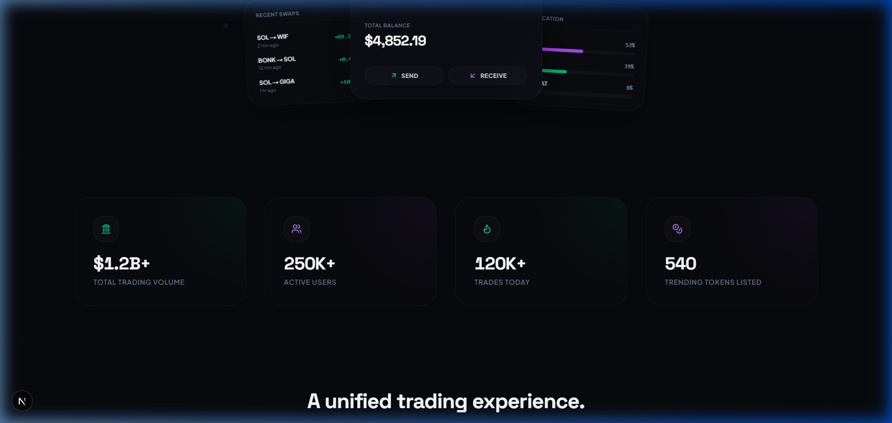
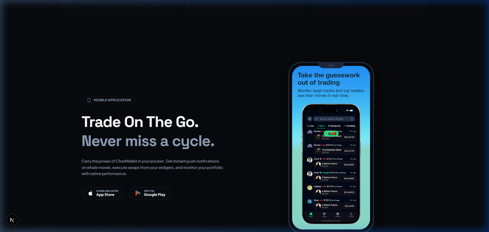
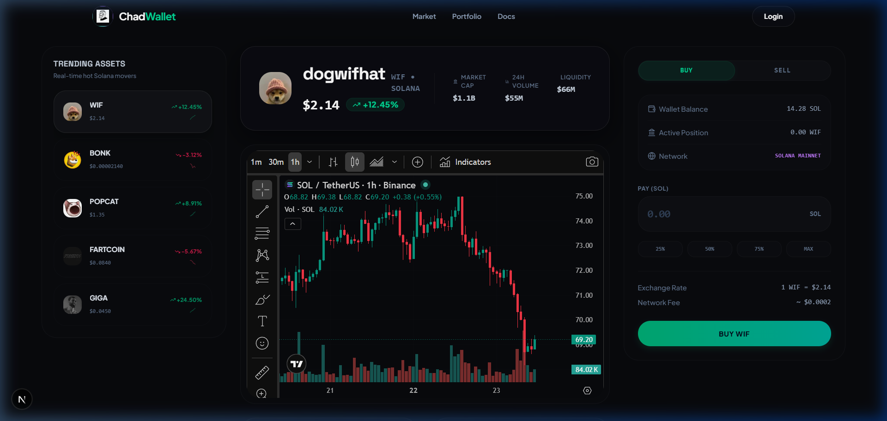
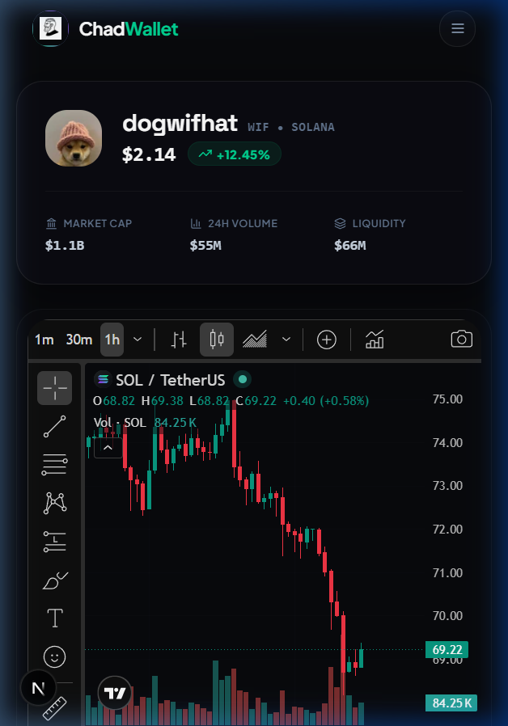

<div align="center">

# 💎 ChadWallet

### Premium Solana Memecoin Trading Platform

An ultra-sleek, responsive Web3 trading experience and landing page inspired by [fomo.family](https://fomo.family). Designed for performance-driven traders to analyze, track, and swap Solana assets with confidence.

[](https://nextjs.org/)
[](https://www.typescriptlang.org/)
[](https://tailwindcss.com/)
[](https://www.privy.io/)
[](https://birdeye.so/)
[](https://vercel.com/)

</div>

---

## 📸 Screenshots

### Landing Page Hero


### Unified Interactive Showcase (Responsive Carousel)


### Mobile Application Download Segment


### Pro Trading Terminal (Desktop Grid)


### Mobile Stacking Layout


---

## ⚡ Features

### 🎨 Landing Page
*   **Aesthetics**: Sleek dark mode featuring modern geometric typography (**Space Grotesk** + **Plus Jakarta Sans**), neon glows, glassmorphism cards, and drifting background canvas micro-animations.
*   **Showcase Carousel**: Collapses into an interactive swipeable slideshow carousel on mobile viewports while preserving stacked 3D overlap display on desktop viewports.
*   **App Badging**: High-fidelity Google Play and App Store badges containing brand-colored vector SVG assets.

### 🔐 Authentication & Solana Wallet
*   **Real Privy Integration**: Multi-method authentication supporting Google/Apple logins.
*   **Solana Embedded Wallet**: Automatically provisions a non-custodial Solana wallet for new users on successful login.
*   **Profile Chip**: Responsive header profile chips showing truncated wallet address or email, featuring a profile dropdown container with disconnect triggers.

### 📈 Pro Trading Terminal
*   **Trending Sidebar**: Ticker tracking sidebar with responsive search filtering (automatically hidden on mobile/tablet viewports to prioritize screen space).
*   **Token Overview**: Displays currency indicators and statistical metrics using deterministic formatting to avoid server-side hydration mismatches.
*   **TradingView Chart**: High-performance interactive charting canvas resizing dynamically to the viewport width.
*   **Executions Stream**: Real-time live trading history logs.
*   **Whale Tracking**: Ranks top holders with custom whale badge indications.
*   **Buy/Sell Panel**: Interactive transaction panel with input state validation, percentage size shortcuts, and execution success toast alerts.

### 📡 Market Data & Fallbacks
*   **API Connection**: Robust BirdEye client fetches live token metadata using lowercase `"x-api-key"` headers.
*   **Graceful Fallback**: All BirdEye requests feature timeout protection and fail-safe recovery, falling back to structured local mock data rather than showing error overlays.

### 📱 Responsive Layouts
*   **Desktop**: Standard 3-column layout (Sidebar, Charts & Stats, Position Card).
*   **Tablet & Mobile**: Collapses dynamically into a vertical stacking flow prioritizing central charting statistics and transaction elements.

---

## 🛠 Tech Stack

*   **Frontend**: Next.js 15 (App Router), React 19, TypeScript, Tailwind CSS, Framer Motion, React Query
*   **Authentication**: Privy (Google, Apple)
*   **Data Feeds**: BirdEye REST API, TradingView Charting Widget
*   **Hosting & Deployment**: Vercel

---

## 📂 Folder Structure

```
chadwallet/
├── .vscode/
│   └── settings.json           # IDE CSS linting rules for Tailwind v4
├── public/
│   ├── app-store/              # App badging source assets
│   ├── flow/                   # Product UI preview mockups
│   ├── logo/                   # Brand logo marks
│   ├── screenshots/            # QA screenshots for documentation
│   └── video/                  # Product video media
├── src/
│   ├── app/
│   │   ├── globals.css         # Tailwind v4 globals & custom animations
│   │   ├── layout.tsx          # Dynamic base metadata & font provider
│   │   ├── page.tsx            # Main Landing Server Component
│   │   └── trade/
│   │       └── [symbol]/       # Dynamic trading dashboard routes
│   ├── components/
│   │   ├── common/             # Reusable UI buttons & error boundaries
│   │   ├── landing/            # Hero, Showcase, App section, & Footer
│   │   └── trading/            # Buy/Sell cards, Chart canvas, Live trades
│   ├── hooks/
│   │   └── useTrendingTokens.ts # TanStack Query fetch wrapper
│   ├── lib/
│   │   ├── api/
│   │   │   └── birdeye.ts      # REST Client & local fallback mock data
│   │   └── utils.ts
│   ├── providers/
│   │   └── Providers.tsx       # Privy & QueryClient context provider
│   └── types/
│       └── token.ts            # Type declarations
├── .env.local                  # Environment keys (confidential)
├── .gitignore                  # Git tracking exclusion filters
├── package.json
└── tsconfig.json
```

---

## 🔑 Environment Variables

To run the application, create a `.env.local` file in the root directory:

```env
# Privy configurations
NEXT_PUBLIC_PRIVY_APP_ID=your_privy_app_id_here
PRIVY_APP_SECRET=your_privy_app_secret_here

# BirdEye API access
NEXT_PUBLIC_BIRDEYE_API_KEY=your_birdeye_api_key_here
```

---

## 🚀 Getting Started

1. Clone the repository and install dependencies:
   ```bash
   npm install
   ```

2. Start the dev server:
   ```bash
   npm run dev
   ```

---


<div align="center">
  <sub>Built for the <strong>ChadWallet Founding Engineer</strong> position.</sub>
</div>
